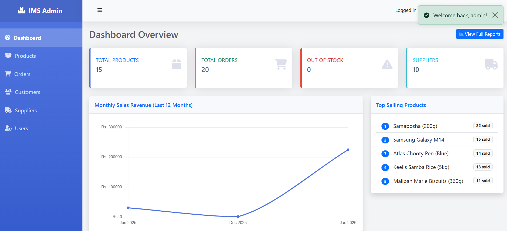
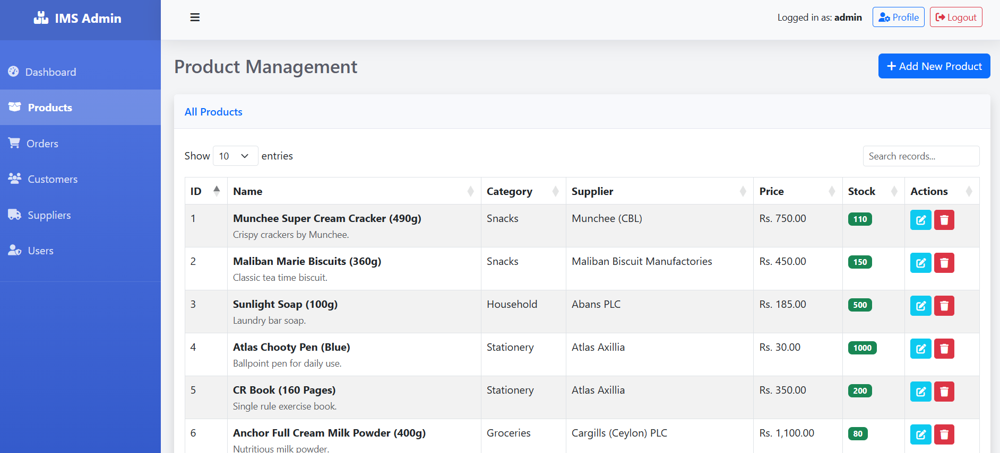
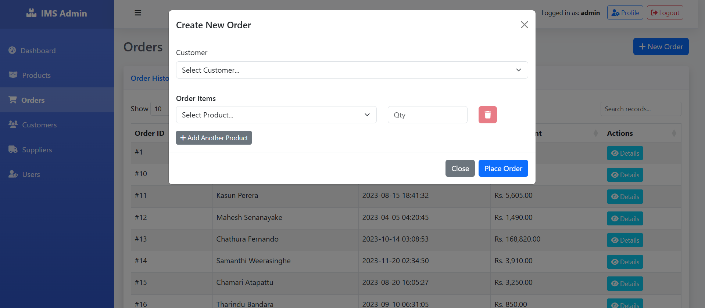
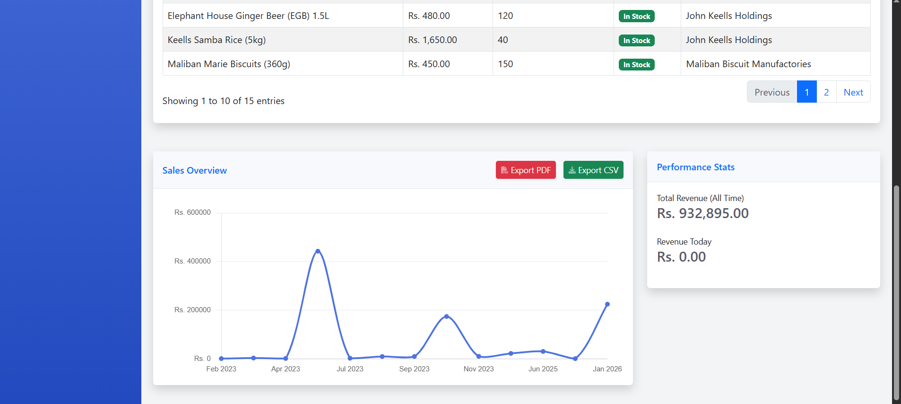
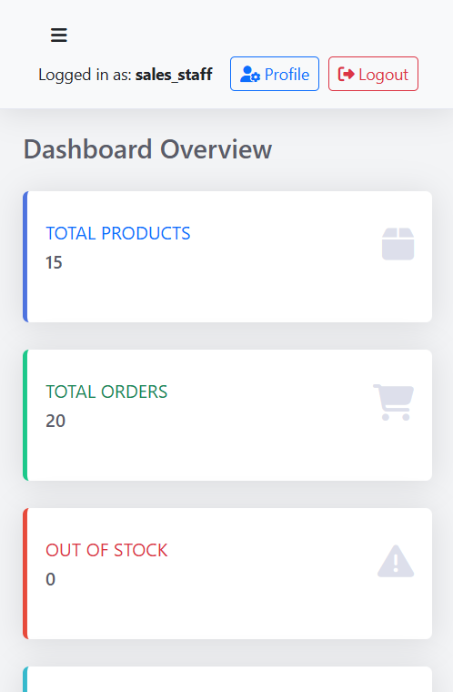

# Inventory Management System (IMS)

A robust, web-based Inventory Management System built with PHP and MySQL. This application is designed to help small to medium-sized businesses manage their stock, sales, customers, and suppliers efficiently.


## 🚀 Features

### 📊 Interactive Dashboard
Real-time overview of total products, orders, low stock alerts, and monthly sales revenue trends (visualized with Chart.js).




### 📦 Product & Inventory Management
Add, update, and delete products with categorization. Real-time monitoring of stock levels with visual status badges.




### 🛒 Order Processing
Create new orders with multiple line items, auto-calculate totals, and automatic stock deduction.




### 📈 Reports & Analytics
Comprehensive reports with **PDF Export** and **CSV Download** capabilities.




### 📱 Responsive Design
Fully optimized for desktop and mobile devices using Bootstrap 5.




## 🛠️ Tech Stack

*   **Backend:** PHP (Native), MySQL (PDO)
*   **Frontend:** HTML5, CSS3, JavaScript (jQuery)
*   **Framework/Libraries:**
    *   [Bootstrap 5](https://getbootstrap.com/) (UI Framework)
    *   [Chart.js](https://www.chartjs.org/) (Data Visualization)
    *   [DataTables](https://datatables.net/) (Interactive Tables)
    *   [jsPDF](https://github.com/parallax/jsPDF) & [AutoTable](https://github.com/simonbengtsson/jsPDF-AutoTable) (PDF Generation)
    *   [FontAwesome](https://fontawesome.com/) (Icons)

## ⚙️ Installation & Setup

This project is designed to run on a standard LAMP/WAMP/XAMPP stack.

### Prerequisites
*   **XAMPP** (or any local PHP/MySQL server environment).
*   Web Browser (Chrome, Firefox, Edge).

### Steps
1.  **Clone/Download:**
    Clone this repository or extract the zip file to your server's root directory (e.g., `C:\xampp\htdocs\inventory_management`).

2.  **Database Setup:**
    *   Open phpMyAdmin (`http://localhost/phpmyadmin`).
    *   Create a new database named `inventory_db`.
    *   Import the `sql/ims.sql` file located in the project folder.
    *   *(Optional)* Run `seed_lka.php` (if provided) to populate with dummy Sri Lankan data.

3.  **Configuration:**
    *   Open `includes/db.php`.
    *   Ensure the database credentials match your local setup:
        ```php
        $host = 'localhost';
        $dbname = 'inventory_db';
        $username = 'root';
        $password = ''; // Default XAMPP password is empty
        ```

4.  **Run:**
    *   Start Apache and MySQL in XAMPP.
    *   Open your browser and navigate to:
        `http://localhost/inventory_management` (or your specific folder path).

## 🔑 Default Login Credentials

*   **Username:** `admin`
*   **Password:** `admin123`

## 📂 Project Structure

```
/
├── api/                # AJAX Endpoint scripts (JSON responses)
├── css/                # Custom Stylesheets
├── includes/           # Reusable PHP components (Header, Footer, DB, Auth)
├── js/                 # Custom JavaScript
├── sql/                # Database Schema (.sql)
├── config.php          # App Configuration
├── dashboard.php       # Main Admin Dashboard
├── products.php        # Product CRUD
├── orders.php          # Order Processing
├── reports.php         # Analytics & Exports
└── ...
```

